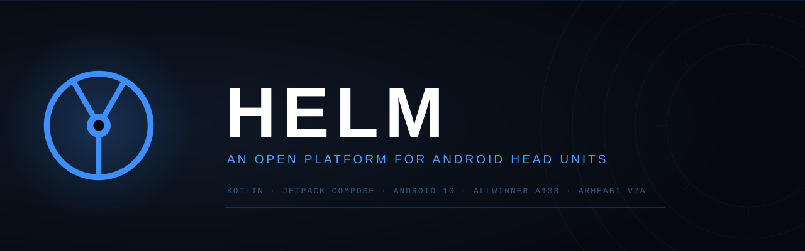

<div align="center">



[](https://github.com/Joshumpa/helm/actions/workflows/ci.yml)


</div>

---

**Helm is a complete car OS for AllWinner A133 head units.** It replaces the stock OEM experience entirely — not just the launcher, but every built-in app. Radio, Bluetooth, navigation, music, camera, and settings are all Helm's own implementations.

The only external apps Helm launches are user-installed apps (YouTube, WhatsApp, etc.). No OEM app is ever launched by Helm.

---

## Architecture

```
Android 10 (API 29)
│
├── System services (Bluetooth, GPS, Audio, MCU/UART)
│
└── Helm SDK          ← isolates all hardware/OEM specifics
        │
        └── Helm feature modules
                │
                ├── :core        launcher shell, app grid, hotseat
                ├── :widgets     clock, speed badge, weather canvas
                ├── :themes      4 variants, DataStore, settings UI
                ├── :audio       music player (ExoPlayer + Media3)
                ├── :navigation  navigation stub (Track A)
                ├── :bluetooth   BT manager stub (Track A)
                ├── :radio       FM/AM via MCU (Track B)
                ├── :carplay     ZLINK via MCU (Track B)
                ├── :settings    in-app configuration UI
                └── :sdk         OEM abstraction, MCU data pipeline
```

The SDK is the critical abstraction layer. Every hardware interaction goes through it. The launcher never calls OEM APIs directly. Supporting a different head unit means updating `:sdk` only.

---

## Development Tracks

Helm runs on two parallel tracks determined by hardware access:

**Track A — No root (active)**  
Features that work without system app privileges: music, Bluetooth (Android APIs), navigation, user app launcher, settings UI, self-update mechanism.

**Track B — Requires root (pending FEL mode)**  
Features that require binding to `com.tw.uart` (system app only): FM/AM radio, reverse camera trigger, real MCU data (speed, ADAS), day/night switching from MCU, CarPlay via ZLINK.

Track B modules compile and run with stub data sources until root is obtained.

---

## SDK

**Track A — available now:**

```kotlin
HelmAudio.nowPlaying(): Flow<NowPlayingState>
HelmBluetooth.scan(): Flow<List<BluetoothDevice>>
HelmBluetooth.connect(device: BluetoothDevice): Flow<BtState>
HelmNavigation.startNavigation(destination: LatLng)
```

**Track B — post-FEL, via McuService:**

```kotlin
McuService.speed(): Flow<Int>            // km/h from MCU
McuService.dayNight(): Flow<DayNight>    // MCU code 0x0204
RadioTuner.tune(frequency: Float)        // FM/AM via MCU UART
ReverseCamera.state(): Flow<CameraState> // triggered by MCU signal
CarPlay.state(): Flow<CarPlayState>      // ZLINK adapter via MCU
```

---

## What's Built

### Home screen
- Speed badge pill with animated color: neutral < 50 km/h, primary 50–89, error ≥ 90
- Weather widget with animated canvas icon (sun, cloud, rain, snow, thunder, haze)
- Live clock card
- Car illustration section
- Split hotseat: 3 left shortcuts | floating mini player | 2 right shortcuts

### Music player (Track A)
- Own ExoPlayer + Media3 implementation — no dependency on OEM media apps
- Local file playback with MediaSession integration
- Mini player on home screen with transport controls and progress bar
- Full Now Playing screen with artwork, seek, skip, library browser

### Theme system
- 4 variants: **Helm** (default dark), **Tesla**, **Android Auto**, **CarPlay**
- Persistent selection via DataStore
- Theme settings screen with live preview swatches
- Both light and dark variants per theme

### UX
- Automotive-grade touch targets: 72 dp primary actions, 56 dp secondary
- Icon launch animation: scale pop with spring physics
- Button press feedback: NoBouncy shadow + MediumBouncy scale
- Screen transitions: NowPlaying slides vertical, Settings slides horizontal (250–320 ms)
- Boot splash: wordmark fade-in 700 ms, auto-dismiss at 1.6 s
- Portrait-only layout, max 3 columns, always `.systemBarsPadding()` on root

### App launcher
- App grid with animated icon press
- Hotseat with configurable shortcuts
- Launches user-installed apps normally via Android launcher intent

---

## How Helm Talks to the Car

Most Android car head units share a common pattern: a microcontroller (MCU) manages all the physical inputs — steering wheel buttons, gear sensor, A/C controls, door contacts, parking radar — and communicates with Android over a serial UART bus.

On AllWinner A133 firmware, the full chain looks like this:

```
MCU (hardware)
  ──serial──▶ libtwutil2.so  (native JNI, PID 1941)
                  │  android.tw.john.TWUtil
       ┌──────────┴─────────────────────┐
       ▼                                ▼
  com.tw.service                   privileged apps
  (system events:                  (vehicle data: speed,
  volume, night mode,              AC, ADAS — via TWUtil
  source switch)                   directly)
```

`android.tw.john.TWUtil` is a hidden platform class provided by AllWinner. It exposes typed event codes — reverse gear, door state, parking radar, ambient temperature, climate control, steering buttons, screen rotation, power-off countdown, and more.

The UART frame format:

```
0xF2  dataType  cmdType  payloadLen  [payload...]  checksum
```

Helm subscribes to these codes directly (with system UID) and maps each to a typed Kotlin event. No polling. No OEM middleware.

---

## Target Hardware

| Component  | Details |
|------------|---------|
| SoC        | AllWinner A133 |
| Android    | 10 (API 29) |
| CPU mode   | 32-bit (armeabi-v7a) |
| RAM        | 4 GB |
| Storage    | 64 GB |
| Bluetooth  | 5.4 |
| Audio IC   | PT2313 |
| Radio IC   | QN8035 |
| MCU        | T13.1.1 |
| SELinux    | Permissive |

---

## Tech Stack

| Layer        | Technology |
|--------------|-----------|
| Language     | Kotlin |
| UI           | Jetpack Compose + Material 3 |
| Architecture | MVVM + Clean Architecture per module |
| Build        | Gradle multi-module |
| Media        | ExoPlayer + Media3 |
| Persistence  | DataStore |
| Async        | Coroutines + StateFlow |
| Min SDK      | Android 10 (API 29) |
| ABI          | armeabi-v7a (release) |

---

## Roadmap

| Version | Track | Scope | Status |
|---------|-------|-------|--------|
| v1 | A | Daily-driver: music, Bluetooth, navigation, settings, self-update | In progress |
| v2 | B | Post-FEL MCU: radio, reverse camera, real speed data, CarPlay/ZLINK | Planned |
| v3 | — | Weather, OBD, voice assistant, automations | Planned |
| v4 | — | Portability to other units, plugin store, public SDK | Planned |

### Development Phases

**Phase 1 — Reverse Engineering** ✅  
Platform fully mapped: system APKs, AIDL interfaces, MCU protocol decoded, CarPlay entry points, all required permissions identified.

**Phase 2 — Infrastructure** ✅  
Gradle multi-module scaffold, Helm SDK interfaces, CI/CD pipeline, static analysis, module boundaries established.

**Phase 3 — User Experience** 🚧  
Automotive-grade Compose UI, theme system, music player, home screen design, screen transitions, animations.

---

## Philosophy

> Instead of asking "how do we modify what the manufacturer gave us?"  
> we ask "how do we make the manufacturer irrelevant?"

---

## License

MIT — see [LICENSE](LICENSE).
